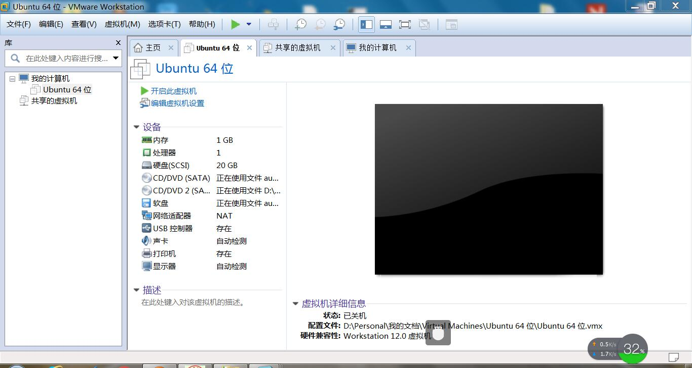

# 装虚拟机   
   由于不敢装双系统怕电脑崩溃，于是就走上了虚拟机的不归路。
   1.首先我们利用VMware软件进行安装。

然后在一系列下一步之后完成安装。之后再次打开VMware
2.然后我们再通过iso软件输入序列号完成最后的安装
3.整个安装过程大约15分钟左右，还算是比较顺利的，但是由于我的电脑配置还不够高，导致运行虚拟机的时候还存在卡顿的现象。
4.最后出现紫色的ubuntu界面，说明已经安装成功了。
